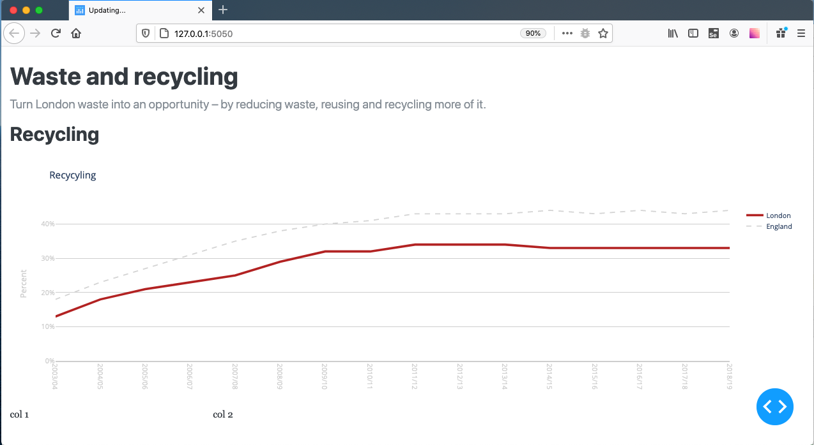
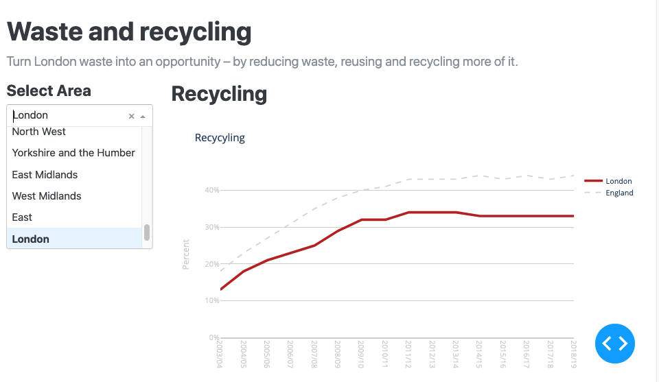
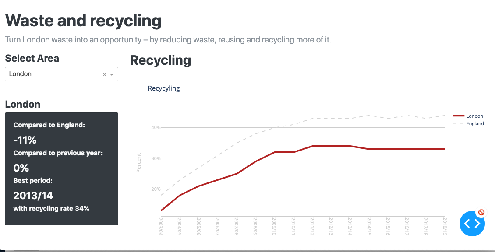

# Introduction to interactivity in Dash

## So far

Last week you were introduced to the basic structure of a dash app which looked something like this:

```python
# Import the required libraries.
import dash
import dash_core_components as dcc
import dash_html_components as html
import plotly.express as px
import pandas as pd

# Import the data set
df = pd.read_csv(path_to_csv_file)

# Create the Plotly figure 
fig = px.bar(df, x="spend", y="date", color="place", title="Purchases by place")

# Create a Dash app
app = dash.Dash(__name__)

# Create the app layout
app.layout = html.Div(children=[
    html.H1('Purchases by place'),
    dcc.Graph(figure=fig)
])

# Run the web app server
if __name__ == '__main__':
    app.run_server(debug=True)

```

You used the dash_html_components to define a static layout in the app.layout.

Code such as:

```python
import dash_html_components as html

html.Div([
    html.H1('First Dash App'),
    html.Div([
        html.P("Dash converts Python classes into HTML"),
    ])
])
```

would turn into html as:

```html

<div>
    <h1>First Dash App/h1>
        <div>
            <p>Dash converts Python classes into HTML</p>
        </div>
</div>
```

You also used the [Graph component](https://dash.plotly.com/dash-core-components/graph) from the `dash_core_components`
library to generate figures. The figures themselves were created using Plotly Express or Plotly Graph Objects and we
mostly used pandas dataframes for manipulating the data.

## Introduction to this activity

In this activity we are going to look at more [Dash core components](https://dash.plotly.com/dash-core-components) and
the use of callbacks for achieving interaction.

The data is from the [London Datastore](https://data.london.gov.uk). The charts mimic those displayed in the Environment
section of the London Datastore website.

In this first activity you are going to modify the `single_page_app` which has the following structure:

```text
/single_page_app/
    app.py  
    recyclingcharts.py  # Creates the recycling chart 
    recyclingdata.py  # Processes the recycling data and statistics
    /assets/  # Directory for css, images etc
    /data/ # Directory containing the datasets
```

The code to manipulate the data and create the charts has been moved to separate files to make app.py easier to read.

### Dash App layout and styling

Have a look at `app.py` and then run it to see the current app.

The app is styled using the dash_bootstrap_components LITERA
theme ([see list of themes](https://dash-bootstrap-components.opensource.faculty.ai/docs/themes/)).

> Try out some of the other themes and choose one you like and apply it to the app.

### Create the page structure using Bootstrap rows and columns

Hopefully you completed the bootstrap activities in week 2. If so you should be familiar with the grid layout that
Bootstrap supports.

One of the ways you can define the overall structure with Bootstrap is to divide the page into rows and columns.

For our app we are going to have a single row with two columns.

The first column will contain the area drop down menu and the summary statistics.

The second column will be used to display the chart. The chart area will have two tabs, a different chart will be
displayed on each tab.

> Modify the `app.layout` to add 1 bootstrap rows and 2 columns. The example below shows how to do this.

Refer to
the [dash-bootstrap-components documentation to understand the 12 column layout](https://dash-bootstrap-components.opensource.faculty.ai/docs/components/layout/)

```python
app.layout = dbc.Container(fluid=True, children=[
    html.Br(),
    html.H1('Waste and recycling'),
    html.P('Turn London waste into an opportunity – by reducing waste, reusing and recycling more of it.',
           className='lead'),
    html.H2('Recycling'),
    dcc.Graph(figure=fig1),

    # Add the first row here
    dbc.Row([
        # Add the first column here. This is for the area selector and the statistics panel.
        dbc.Col(width=3, children=[
            html.P('col 1')
        ]),
        # Add the second column here. This is for the figure.
        dbc.Col(width=9, children=[
            html.P('col 2')
        ]),
    ]),
])
```

When you save the changes to app.py your app should update in the browser. Make sure the app still runs. You should see
something like this:


> Move the chart into the second column and remove the 'col 2' placeholder paragraph.

i.e. you are looking to move:

```python
html.H2('Recycling'),
dcc.Graph(figure=fig1),
```

Currently we see a chart comparing the average rate for all of England to the average rate for London. Let's add a selector
to 'col1' allow us to choose a different area rather than London. This will be a form with a h4 heading and a dropdown.
The code to do this will be something like this:

```python
# dash-bootstrap-components (dbc) provides the form group styling
dbc.FormGroup([
    html.H4("Select Area"),
    # dash-core-components (dcc) provides a dropdown
    dcc.Dropdown(id="area_select", options=[{"label": x, "value": x} for x in data.area_list], value="London")
]),
```

Note: the list of areas is contained in our Data class instance and accessed using `data.area_list`

Save your changes and the page should now look something like this:


> Now add a div for the stats panel just below the area selector form.

The code might look like this:

```python
         dbc.Col(width=3, children=[
    # dash-bootstrap-components (dbc) provides the form group styling
    dbc.FormGroup([
        html.H4("Select Area"),
        # dash-core-components (dcc) provides a dropdown
        dcc.Dropdown(id="area_select", options=[{"label": x, "value": x} for x in data.area_list], value="London")
    ]),
    # Output panel for the stats. This will use a bootstrap card format.
    html.Br(),
    html.Div(id="output-panel")
]),
```

While you can use the area selector drop down, nothing happens when you select an area.

### Add a callback so that the statistics panel is displayed when an area is selected

A callback function is a Python function that is automatically called by Dash whenever an input component's property
changes.

The basic structure of the callback is:

```python
@app.callback(Output(component_id='my-output', component_property='a_property'),
[Input(component_id='my-input', component_property='another_property')]
)
def update_output_div(input_value):
    return 'Output: {}'.format(input_value)
```

- By writing this decorator, we're telling Dash to call this function for us whenever the value of the "input"
  component (the text box) changes in order to update the children of the "output" component on the page (the HTML div).

- You can use any name for the function that is wrapped by the @app.callback decorator. The convention is that the name
  describes the callback output(s).

- You can use any name for the function arguments, but you must use the same names inside the callback function as you
  do in its definition, just like in a regular Python function. The arguments are positional: first the Input items and
  then any State items are given in the same order as in the decorator.

- You must use the same id you gave a Dash component in the app.layout when referring to it as either an input or output
  of the @app.callback decorator.

- The @app.callback decorator needs to be directly above the callback function declaration. If there is a blank line
  between the decorator and the function definition, the callback registration will not be successful.

To create a callback we need to:

- Define the Input: identify the component id (e.g. id of an html element) and component property that the user will
  interact with
  
- Define the Outputs: identify the component id and property that will be updated after we make a change
  
- Write a Python function using the @callback decorator. The function will be run when the Input has been selected

To update the statistics panel when the area dropdown selection is changed we need to:

- **Input**: If you look at the first column in our app layout you should see the form we created for the dropdown. The
  dropdown has an `id=area_select'` and the item that is selected from the list is the `value=` parameter. The Input
  functionality is a class provided in the dash.dependencies module so we will need the
  import `from dash.dependencies import Output, Input`. So, we can reference the country that is selected
  as `Input("area_select","value")`

- **Outputs**: The last line of the first column in the app layout added a placeholder div: `html.Div(id="output-panel")`.
  We want to output a Bootstrap card with the statistics in and place it in this div, that is the card becomes
  the `children=` of the `html.Div(id="output-panel")`. So, we can reference the div as our output
  as `Output("output-panel","children")`.

- **Callback function**: The function will take the area name selected in the dropdown and process the data for that
  area. The stats are calculated in `recyclingdata.py` are the resulting data is used to generate a bootstrap styled card with the statistical summary data.
  The HTML page is then updated by passing this 'card' to the div with the id of `"output-panel"`.

The code to do this is as follows. Copy and paste this into the end of `app.py` after the layout and then 'save' to update the app.

```python
from dash.dependencies import Output, Input


@app.callback(Output("output-panel", "children"), [Input("area_select", "value")])
def render_output_panel(area_select):
    data.process_data_for_area(area_select)
    panel = html.Div([
        html.H4(area_select, id="card_name"),
        dbc.Card(body=True, className="bg-dark text-light", children=[
            html.Br(),
            html.H6("Compared to England:", className="card-title"),
            html.H4("{:,.0f}%".format(data.compare_to_eng), className="card-text text-light"),
            html.Br(),
            html.H6("Compared to previous year:".format(area=area), className="card-title"),
            html.H4("{:,.0f}%".format(data.change_area), className="card-text text-light"),
            html.Br(),
            html.H6("Best period:", className="card-title"),
            html.H4(data.best_period, className="card-text text-light"),
            html.H6("with recycling rate {:,.0f}%".format(data.best_rate), className="card-title text-light"),
            html.Br()
        ])
    ])
    return panel

```
The summary stats should change as the area is changed. Your app might now look something like this:


The next step is to change the charts.

### Update the chart when an area is selected

> Now it is over to you, see if you can a callback to app.py that takes the same input as the stats panel and outputs to the chart component with the id `recycle-chart`. 
> The function, `update_recycling_chart(area_select)`  takes the area, processes the data for that area, and creates a new figure. 
> To create the new figure you can use `fig1 = rc.create_chart(area_select)`

**Challenges**
> 1. Add a second chart that is accessed as a tab within the second column. Hint: lookup `dbc.Tabs` and `dbc.Tab`.
     
> 2. Add an update method so that this is also changed when the area is changed.
   