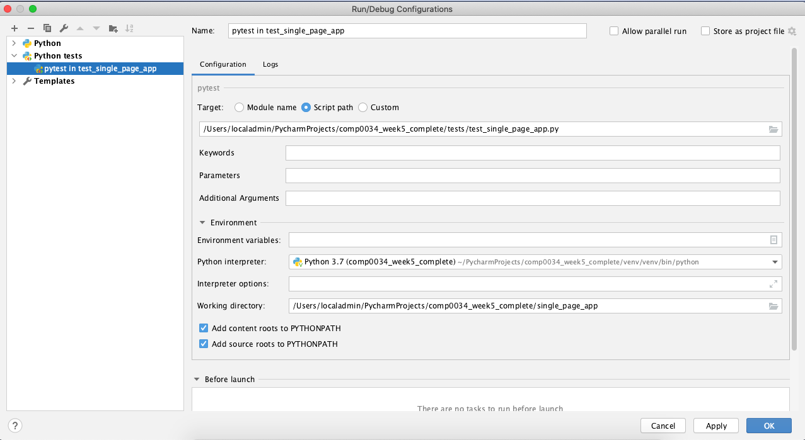

# Integration testing for Dash apps

## Introduction to this activity

In COMP0035 you learned how to use pytest to create unit tests, and Selenium webdriver to test a Flask application.

This activity will introduce you to testing your Dash app using pytest and Selenium webdriver. You will test the single
page Dash app in the `single_page_app` directory.

It is based on the guidance on testing given in the [Dash documentation](https://dash.plotly.com/testing). You will need
to refer to this documentation if you create Dash tests for your final application in coursework 2.

**NOTE: You do not need to write any tests for your Dash app for coursework 1.**

## Install pytest and configure its use for your project

Pytest was included in the requirements.txt for the repository. If you did not install when you created the project then
you will need to do so now e.g. `pip3 install pytest`.

You may also need to configure your IDE to use pytest to run the tests. For
PyCharm [enabling pytest for a project](https://www.jetbrains.com/help/pycharm/pytest.html#enable-pytest).

## Set-up dash testing

Enter `pip install dash[testing]` in a terminal/console within your venv. In PyCharm you can open the Terminal by going
to View - Tool Windows - Terminal and then enter `pip install dash[testing]`

## Download the correct version of Chrome driver for your computer

Check your version of Chrome in the Chrome settings.

For example, mine is: Version 84.0.4147.125.


Go to [Chrome driver downloads](https://sites.google.com/a/chromium.org/chromedriver/downloads) and select the version
for your version Chrome.

In the next window you then need to download the correct driver for your operating system.

The [Selenium documentation](https://www.selenium.dev/documentation/en/webdriver/driver_requirements/) explains where to
place it in Windows and how to add it to the path, and for MacOS.

My experience on a MacBook was that I also had to complete the following steps:

- Download the driver
- Try to open the driver from the download directory, this prompts you to change the security settings for the file (
  System Settings | Security & Privacy | General and then click on 'Open Anyway').
- Close the driver
- Move the driver from downloads to usr/local/bin

## Running the tests in PyCharm

When following the official documentation executing the tests from terminal using `pytest tests --log-cli-level DEBUG`
resulted in `(ModuleNotFoundError: No module named 'dash_app')`. The workaround was to run the tests using the PyCharm
run menu with a configuration for running pytest.

Go to Run - Edit configurations.
Use the '+' in the top left to add a new configuration and scroll down the list to select a pytest congiguration.
I added settings as follows:



# Create the first test

Boiler plate code for creating a test is given in the Dash documentation.

This was used when writing `tests/test_single_page_app.py`. Open this file now before reading the rest of this document.

## Name the test

In the documentation the test function name follows this pattern: test_{tcid}_{test title}.

The tcid (test case ID) is an abbreviation pattern of mmffddd => module + file + three digits.

You do not have to follow this pattern if you are following a different naming convention for your tests. As you should
remember from COMP0035 it is a good idea to start with `test_` as many test runners will autodetect tests based on this
naming pattern. The name of the test should also indicate what the test does.

I have used a slightly different 'tcid' using the an abbreviation for the app plus 3 digits.

You should see that the first test is named:

```python
def test_spa001_h1textequals(dash_duo):
```

## Create the dash app

The boilerplate code suggests that you define and create the app in every test case. This would lead to a lot of
repetition and become difficult to maintain. Instead we will create the app by using the `import_app` function which is
in the application_runners module:

```python
from dash.testing.application_runners import import_app


def test_spa001_h1textequals(dash_duo):
    app = import_app("single_page_app.app")
```

The docstring for the `import_app` function explains how to reference your dash app:

```python
"""Import a dash application from a module. The import path is in dot
    notation to the module. The variable named app will be returned.

    :Example:

        >>> app = import_app("my_app.app")

    Will import the application in module `app` of the package `my_app`.

    :param app_file: Path to the app (dot-separated).
    :type app_file: str
    :param application_name: The name of the dash application instance.
    :raise: dash_tests.errors.NoAppFoundError
    :return: App from module.
    :rtype: dash.Dash
    """
```

You do not need to explicitly create and declare the Selenium webdriver. This is created for you using the Chrome driver
as default. If you want to use a different driver e.g. Firefox, you will need to read the Plotly Dash documentation for
how to do this.

## Waits

If you recall, Selenium webdriver loads the web app, however the tests could run before the page has finished rendering
and a test may fail as a given element was not yet available. To avoid this you can use waits, either to wait for a set
period of time or to wait for a particular event on the page.

In the first test we wait for the first `<h1>` element to be available:

```python
dash_duo.wait_for_element("h1", timeout=4)
```

## Write the assertion(s)

We covered writing assertions in COMP0035. If you recall, pytest uses `assert` for all assertions (rather than different
assertion types such as assert_equal, assert_contains etc).

For the first test we are assert that the text in the `<h1>` element is 'Global Covid-19 daily cases'. However, the
bootstrap style that we apply to this converts the text to uppercase, so the test would fail.

Instead a step has been added to compare the strings ignoring the case using the python function `.casefold()`. There
are other techniques you could use such as `.upper()`, `.lower()`, or REGEX pattern matching.

h1_text = dash_duo.find_element("h1").text assert h1_text.casefold()  == 'Waste and recycling'.casefold()

# Add a test
Now try and add at least one more test to `test_single_page_app.py`.

Write your own test to assert that when the area dropdown is changed to Hackney that the card title for the stats panel
is also changed to Hackney.

Write the code that would carry out the test. For this test wou will need to simulate the user selecting an option from
the dropdown which you can do using `select_dcc_dropdown(elem_or_selector, value=None, index=None)`
